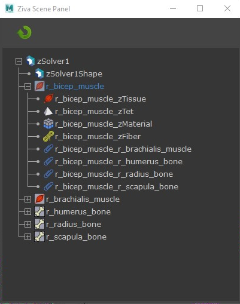
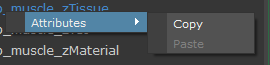
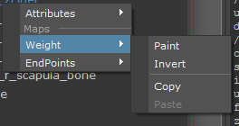

.. include:: <isonum.txt>
.. _sec-ScenePanel:

Scene Panel
============

.. note:: Scene Panel will be superseded by :ref:`sec-ScenePanel2`.

The Scene Panel is an object-viewing tool used to inspect the Ziva setup,
and is based on the **zBuilder** retrieve operation.

The Ziva Scene Panel allows quick browsing of a subset of the Ziva objects in the scene.
The selected Ziva objects and their immediate connections are shown in a tree,
focusing on those specific parts of the scene.
To display the full scene in the panel, select the solver and launch the scene panel,
or click the **Refresh** |refresh_icon| button if the scene panel is already open.

By selecting muscle or bone geometry and launching the Scene Panel,
all related attachments will be traced, and any connected objects will be displayed in a tree view.
By launching the scene panel while an attachment is selected,
the source and destination of the attachment are added to the tree view.
This is done in order to grant the user control over what is viewed,
and to minimize the amount of items one has to sort through.

Selecting an item in the panel selects the corresponding item in the Maya scene.

.. note:: If the Maya scene is changed, the panel is not automatically updated.
          Update it by closing the Scene Panel and re-opening it via **Ziva** |rarr| **Launch Scene Panel**.
          Another approach is to press the **Refresh** |refresh_icon| button on the Scene Panel toolbar.

The Scene Panel can also be launched from python:

.. code-block:: python

  from scenePanel.ui import zUI
  zUI.run()

.. _sec-ScenePanelMenu:

Right-click Menu
----------------

Attributes Sub-Menu
^^^^^^^^^^^^^^^^^^^

If a node has attributes to manipulate, an **Attributes** sub-menu will appear on the right-click menu.

Copy
""""
This will copy all attributes values which can then be pasted onto a node of same type
(i.e., **zAttachment** |rarr| **zAttachment**).

Paste
"""""
This pastes the attribute values onto the selected node.

.. note::
    The paste button is disabled if there is nothing in the clipboard or
    the clipboard content type does not match with the current selection type.

Maps Sub-Menu
^^^^^^^^^^^^^

If a node has any weight maps associated with it, a sub-menu for each map appears on the right-click menu.
In the image above, sub-menus for 'Weight' and 'EndPoints' (which are attribute maps of a zFiber node) are shown.

Paint
"""""
This sets up the viewport with the painting context so you can paint the map.
This is the same as right-clicking in viewport and choosing **Paint** |rarr| **zFiber**.

Invert
""""""
This inverts the map.  Values of 1 become 0 and vice versa.
A good example case is in layering material maps.
It is possible to make a copy of a painted material map, and then invert the copy.
This will result in two maps that cover the whole mesh.

Copy
""""
This copies the selected map into the clipboard, and can then be pasted.

Paste
"""""
Pastes the map values in the clipboard onto the selected map.
This is handy if you want to copy a map from one node type to another.
A good example is if there is a fiber weight map
and the same map is to be applied to a material.

.. note::
    When attempting to copy a map onto a mesh with different topology,
    a dialog box will pop up asking for confirmation.
    It is likely that unpredictable behavior will occur as a result of such a copy.

Select Source and Target
^^^^^^^^^^^^^^^^^^^^^^^^
This item appears on a zAttachment node.
It selects both the source and target mesh for convenience.

Paint by Proximity Sub-Menu
^^^^^^^^^^^^^^^^^^^^^^^^^^^
This paints an attachment weight map on the source of a zAttachment node.
This map falls-off smoothly between the prescribed min and max distance from the target.

