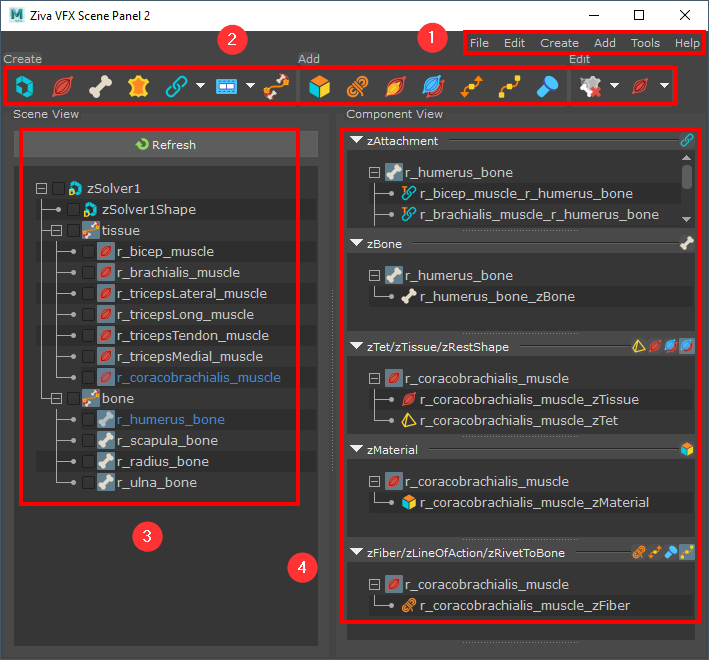

.. include:: <isonum.txt>
.. _sec-ScenePanel2:

Scene Panel 2
===============

Scene Panel 2 is a tool to view and organize Ziva VFX nodes and edit their attributes.
It allows for quick browsing and editing of a subset of Ziva VFX nodes in the scene.
It is based on the **zBuilder** retrieve operation results, and intends to supersede the :ref:`sec-ScenePanel`.

To launch it, click the **Scene Panel** |sp_shelf_button| shelf button,
or navigate to **Ziva** |rarr| **Launch Scene Panel**.

The Scene Panel 2 can also be launched using python:

.. code-block:: python

  from scenePanel.scenePanel2 import main
  main.run()

If the previous Scene Panel is preferred,
define the **ZIVA_ZBUILDER_USE_SCENE_PANEL1** environment variable with any value and restart Maya.
Scene Panel 1 can then be launched as described above.

**Interface overview**

This section is a brief summary of the main interface.
Numbered headings below refer to the numbered interface elements in the figure.

1. **Menubar**

   Menubar contains most of the functionalities to work with the Ziva VFX scene.

2. **Toolbar**

   Toolbar contains frequently used features organized by sections.
   Some toolbar buttons have submenus to access related features.

3. **Scene View**

   Scene View shows Ziva VFX scene objects: Solver, Bone, Tissue and Cloth.
   They can be managed by creating Group nodes and reordering them through drag&drop.

4. **Component View**

   Component View shows each component according to the current scene's selected object(s).
   Users can apply attributes, maps, or copy/paste operations through the popup menu.

.. toctree::
    sp2_menuBar.rst
    sp2_toolBar.rst
    sp2_sceneView.rst
    sp2_componentView.rst