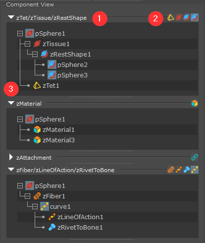
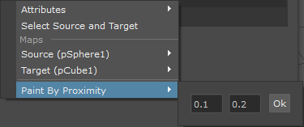

.. include:: <isonum.txt>

.. _sec-ComponentView:

Component View
---------------

General Introduction
^^^^^^^^^^^^^^^^^^^^^^^^

Component View displays detailed Ziva VFX component object infomation,
according to the selected and/or pinned objects in the :ref:`sec-SceneView`.
Each component instance is displayed as a tree structure inside a Component Section View,
with its parent object in the Scene View as root.
Same component types, or related types are group together in the same tree structure.
For example, if a tissue object has muscle fiber as well as line of action,
both of these will be displayed in the same Component Section View.
Users can browse the component objects and edit the maps affiliated maps through popup menu.
Numbered headings below refer to the numbered interface elements in the figure.

1. **Component Type Name**
2. **Component Type Icon**
3. **Fold Button**

The name and icon of component type are shown at the top of each view.
If there are multiple components, the name and icon will be shown altogether.
The leftmost button beside component name is a fold button.
When clicked, it folds/expands the current component view.

Right-click Menu
^^^^^^^^^^^^^^^^^

Components with paintable maps can be edited through the context menu.

Attributes Sub-Menu
""""""""""""""""""""

.. image:: ./images/scene_panel2.png
    :alt: The Attributes section.

If a node has attributes to manipulate an **Attributes** sub-menu will appear on the right-click menu.

**Copy**

This will copy all attributes values and allow you to paste onto a node of same type,
i.e., **zAttachment** |rarr| **zAttachment**.

**Paste**

This pastes the attribute values onto the selected node.

.. note::
    The paste button is disabled if there is nothing in the clipboard or
    the clipboard content type does not match with the current selection type.

Maps Sub-Menu
""""""""""""""

.. image:: images/scene_panel3.png
    :alt: The Maps section.

If a node has any weight maps associated with it, a sub-menu for each map appears on the right-click Menu.
In the image above, sub-menus for 'Weight' and 'EndPoints' (which are attribute maps of a zFiber node) are shown.

**Paint**

This sets up the viewport with the painting context so you can paint the map.  This is the same as
in viewport right clicking and choosing **Paint** |rarr| **zFiber**.

**Invert**

This inverts the map.  Values of 1 become 0 and vice versa.
A good example case is in layering material maps.
It is possible to make a copy of a painted material map, and then invert the copy.
This will result in two maps that cover the whole mesh.

**Copy**

This copies the selected map into the clipboard, and can then be pasted.

**Paste**

Pastes the map values in the clipboard onto the selected map.
This is handy if you want to copy a map from one node type to another.
A good example is if you have a fiber weight map
and you want the same map to be applied to the material.

.. note::
    When attempting to copy a map onto a mesh with different topology,
    a dialog box will pop up asking for confirmation.
    It is likely that unpredictable behavior will occur as a result of such a copy.

zAttachment Sub-Menu
"""""""""""""""""""""

**Select Source and Target**

This item appears on a **zAttachment** node.
It selects both the source and target mesh for convenience.

**Paint by Proximity Sub-Menu**

For a **zAttachment** this paints the attachment weight map on the source that falls-off smoothly between the prescribed min and max distance from the target.

