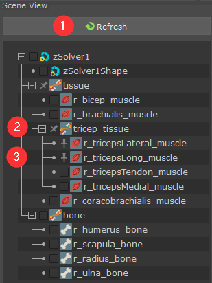
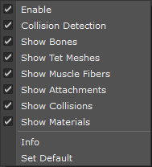

.. _sec-SceneView:

Scene View
---------------

General Introduction
^^^^^^^^^^^^^^^^^^^^^^^^

Scene View displays Ziva VFX objects as a tree.
The zSolverTransform node is the root,
Maya meshes that zBone, zTissue and zCloth build upon are shown as child items.
Users can select or pin these objects to show the detailed component types in the :ref:`sec-ComponentView`.
Numbered headings below refer to the numbered interface elements in the figure.

1. **Refresh button**
2. **Group node**
3. **Pin box**

Refresh button 
^^^^^^^^^^^^^^^^^^^^^^^^
Refresh button is used to update and sync the Scene View with current Maya scene.
When there is no object selected in the Maya scene, the Scene View shows **full view** state.
It shows **partial view** state if there is any object selected in the Maya scene.
In the **full view** state, all Ziva VFX objects are displayed, a Group node can be created,
items are allowed to be dragged & dropped.
In the **partial view** state, the Scene View only displays the objects relate to current selection.
Group node is not shown and you can't create it either.
Drag & drop is disabled in this view.

When right click on the empty area of Scene View, a popup menu is shown with the same **Refresh** option.

.. |group_icon| image:: images/out_group.png

Group node
^^^^^^^^^^^^
A Group node is used to organize Ziva VFX objects in the Scene View.
To create the Group node, first select the items in the Scene View,
then click the **Group node** |group_icon| toolbar button, or **Ctrl + G** hotkey.

.. note::
  In **partial view** state, Group node can't be created.
  A warning message will show.

To rename the Group node, double click and type the new name, then press Enter.
The valid Group node name must starts with alphabet.
Underscore, numbers and alphabets are allowed after the inital charater.
Space or tab are not valid characters, nor does empty name.

When right click on the Group node, a popup menu is shown with the **Select Hierarchy** option.
It selects all child items recursively.

Pin box
^^^^^^^^^^^^
When Ziva VFX objects are selected, their component types are shown in the :ref:`sec-ComponentView`.
To keep objects shown in the **Component View** even when not selected,
you can pin them by checking the **Pin box** beside each item.

The checkbox shows current status: **unchecked**, **checked** and **partially checked** (for Group node).

Drag & drop
^^^^^^^^^^^^
You can drag & drop items in the same zSolver scope, in or out of a Group node, rearrange items order.
You can't drag & drop items across a zSolver node, nor before zSolver and zSolverTransform nodes.

.. warning::
  Due to a Maya 2020 problem, drag & drop is not supported in that version.

zSolverTransform Right-click Menu
^^^^^^^^^^^^^^^^^^^^^^^^^^^^^^^^^^^^

When right click on **zSolverTransform** node, the popup menu shows following options:

* **Enable**
  Turns the solver on or off.

* **Collision Detection**
  Enables/disables collisions for this solver.
  
* **Show Bones**
* **Show Tet Meshes**
* **Show Muscle Fibers**
* **Show Attachments**
* **Show Collisions**
* **Show Materials**
  
  Show/hide each component respectively.

* **Info**
  
  Returns info about the selected solver or tissue.
  If there is only one solver in the scene, no selection is required.
  
  This is the same as executing **ziva -i;**
  
  Example output::

    Solver Info
    ===============
    Num Tissues:      51
    Num Fiber Fields: 13
    Num Bones:        195
    Num Attachments:  330
    Num Proxy Points: 21054
    Num Tri Vertices: 74306
    Num Tet Vertices: 10166
    Num Tets:         27359
    
    Tissue Info
    ===============
    Name : |pSphere1|pSphereShape1
    Num Tri Vertices : 382
    Num Tris : 760
    Num Tet Vertices : 2400
    Num Tets : 600

* **Set Default**
  
  Sets the default solver to the selected solver.
  
  This is the same as executing **ziva -ds;**
  
  The default solver is used for ziva commands whereby two or more solvers exist in the scene,
  and the specific solver is not selected.
  It is useful in multi-solver workflows when adding (many) simulation bodies to a solver.
  In an interactive session, it makes the workflow more convenient,
  because one does not have to keep selecting the specific solver
  when addding the next simulation body to a solver.
  
  See the notes in :ref:`Create solver<sec-create-solver>` for more details about how Ziva chooses which solver to use for a given command.
