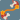
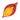
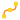

Toolbar
------------

.. _sec-toolbar-create-section:

Create Section
^^^^^^^^^^^^^^^

.. |zsolver_icon| image:: images/out_zSolver.png

.. _sec-create-solver:

|zsolver_icon| zSolver
""""""""""""""""""""""""""""
Multiple solvers can be present in a scene.
Each tissue, cloth, bone, attachment, etc., resides in one solver.
The different solvers are completely independent.

This is the same as executing **ziva -s;**

.. note::

  When there is only one solver in a scene, Ziva commands will always use that solver.
  However, if there is more than one solver in a scene, Ziva commands will attempt to choose a
  solver based on the following logic:

    #. Top priority is given to solver nodes that are selected directly. Selecting a solver's cache node is equivalent to selecting the solver node.
    #. Next, solver nodes connected to selected simulation objects are considered.
    #. Finally, the Default Solver is chosen, which can be set with `Set default <https://docs.zivadynamics.com/vfx/ziva_menus.html#set-default>`_ menu.

  If the ambiguity between multiple solvers cannot be resolved, an error message is printed.
  Examples of unresolvable ambiguity include:

   - Multiple solver nodes/caches in the selection.
   - Simulation bodies from multiple solvers in the selection.
   - No Default Solver has been set.

.. note::
   All solvers always simulate when pressing Play, regardless of the current selection and the default solver.
   If you don't want a solver to simulate, you can disable it by setting
   its `zSolverTransform.enable <https://docs.zivadynamics.com/vfx/nodes/zSolverTransform.html>`_ to **off**.

.. |ztissue_icon| image:: images/out_zTissue.png

|ztissue_icon| zTissue
""""""""""""""""""""""""""""
Convert the selected maya mesh(es) into tissue(s), the term we use to describe elastic solids in our system.

This is the same as executing **ziva -t;**

.. note:: If no solver exists in the session, one will be automatically created.

.. |zbone_icon| image:: images/out_zBone.png

|zbone_icon| zBone
""""""""""""""""""""""""
Convert the selected maya mesh(es) into bone(s), the term we use to describe externally animated Maya meshes in our system.

This is the same as executing **ziva -b;**

.. note:: If no solver exists in the session, one will be automatically created.

.. |zCloth_icon| image:: images/out_zCloth.png

|zCloth_icon| zCloth
""""""""""""""""""""""""""
Convert the selected maya mesh(es) into cloth, the term we use to describe the elastic thin objects in our system.

This is the same as executing **ziva -c;**

.. note:: If no solver exists in the session, one will be automatically created.

.. |zAttachment_icon| image:: images/out_zAttachment.png

|zAttachment_icon| zAttachment
""""""""""""""""""""""""""""""""""""
Attach tissues/cloth to bones, or tissues/cloth to other tissues/cloth.

Exactly two simulation objects must be selected.
The selection order is important; the first selected item's vertices will be constrained to the second selected item.
By default, all of the vertices of the first object will be constrained to the second object.
However, if you select specific vertices on the first object before executing the command,
only those vertices will be constrained.

After an attachment is created,
you can change which vertices are constrained by painting attachment weights on the first object.
You can also paint the attachment weights on the second object --
this restricts the vertices of the first object to only be constrained to the painted region on the second object.

By default, attachments are fixed.
After you create the attachment, you can change its type to sliding.

This is the same as executing **ziva -a;**

Goal Attachment
"""""""""""""""""""""""
Constrain tissues/cloth to a (externally animated) bone, using an adjustable soft constraint.
The bone's geometry must topologically match the tissue or cloth.

This type of attachment can be used to add dynamics to an externally generated animation.
For example, animate a Maya mesh using any technique and convert it into a bone.
Then, duplicate that mesh on frame 1, convert the duplicate into a tissue,
and then goal the tissue to the bone.
The tissue will generally follow the bone, but will be enriched with secondary dynamics.
Also, any "kinks" in the bone motion will be automatically corrected into a good-looking physically-based output.

One use case would be to add mesh relaxation and dynamics to a blendShape-driven face.
Another one is if you want to use your own muscle system,
but then want to use our system to add dynamics to your muscles.

Note that the goal bone will automatically have collisions disabled,
since the only way it's meant to interact with the scene is to act as a goal shape for the tissue or cloth.

This is the same as executing **ziva -ga;**

Swap Attachment Inputs
"""""""""""""""""""""""
For the currently selected attachment(s), swap the source and target bodies in the attachment.

This is the same as executing **ziva -sai;**

.. |zCache_icon| image:: images/out_zCache.png

|zCache_icon| zCache
""""""""""""""""""""""""""""""""""""

Add a Ziva cache to the solver (or selected solver in the event you have multiple solvers in the scene).

After creating the cache, the solver's output will be saved,
so that each subsequent time you run the simulation,
it will be played back from the cache instead of re-solved.
If you reach the end of the already-cached frames, the solver will begin simulating again,
and the results appended to the cache.
Once the cache is created,
anytime you wish to re-generate the simulation result you will need to first Clear the cache.

The cache is implemented in Maya as a pair of nodes, zCacheTransform and zCache.
Selecting these nodes allows for cache settings to be modified.

This is the same as executing **ziva -acn;**

|clear_zCache_icon| Clear
""""""""""""""""""""""""""
Clear the Ziva cache.
If more than one cache node exists in the scene, the selected cache will be cleared.
If no cache node is selected, cached nodes of all solver nodes in the scene will be cleared.

Once you add a cache, you need to call this command each time you want to generate a new simulation;
otherwise, the old simulation will simply be played back from the cache.

This is the same as executing **from utility.scriptCommands.zCacheCommands import clear_zcache; clear_zcache();**

Save zCache
""""""""""""
Save a ziva cache file to the specified location on disk.

This is the same as executing **zCache -s <filename>;**

Load zCache
""""""""""""
Load a ziva cache file from the specified location on disk.

This is the same as executing **zCache -l <filename>;**

Select zCache
""""""""""""""
Select the current cache node (or the cache for the selected solver, if there are multiple).

This is the same as executing **zQuery -t zCacheTransform;**

|group_icon| Group node
""""""""""""""""""""""""
Create Group node in the Scene View of Scene Panel 2.
It organizes the zTissue, zBone and zCloth by category.

.. _sec-toolbar-add-section:

Add Section
^^^^^^^^^^^^
.. |zMaterial_icon| image:: images/out_zMaterial.png

|zMaterial_icon| Material Layer
""""""""""""""""""""""""""""""""
This command adds an additional material layer to the selected tissue(s)/cloth by connecting an additional zMaterial node to it.

The newly added material is positioned on top of any previously created layers.
Multiple material layers are blended together similar to how images are composited using an alpha channel,
with the material's painted map controlling the alpha value.
For every point on the simulation body's surface,
the blended material stiffness will be alpha * top Material + (1-alpha) * previous Layers.
Since the default alpha value for the new material layer is 1.0,
this new zMaterial node will override the previous material layers
until the weight map of the new material is painted so as to reveal them.

This is the same as executing **ziva -m;**

.. |zFiber_icon| image:: images/out_zFiber.png

|zFiber_icon| Muscle Fiber
"""""""""""""""""""""""""""
Add a zFiber node the the selected tissue(s), converting a regular tissue to a "muscle".

Upon creation, the zFiber weights will need to be painted in order to direct the muscle fiber field.
This is accomplished by first flooding the weights to 0.5, and then painting the values of 0.0 and 1.0 to the vertices that you've chosen as surface points that you would like the fibers to flow between.
We refer to vertices with a value of 0.0 as an "in point" and those with a value of 1.0 as an "out point".
Any number of in and out points can be used to direct the fiber field direction.
The painted fiber field is also used to determine the direction of anisotropy with anisotropic materials.

This is the same as executing **ziva -f;**

|zSubtissue_icon| Subtissue
""""""""""""""""""""""""""""
Given a selected 'parent' tissue and 'child' tissues, convert the child tissues into subtissues of the parent.

A subtissue is not an independent part of the simulation; instead it defines materials, muscle fibers, and attachments within its parent tissue.
This is useful for controlling the material properties of exact internal regions of a tissue.
Without subtissues, the internal material properties of a tissue are just interpolated from the surface, with no way to control them manually.

This is the same as executing **ziva -ast;**

.. |zRestShape_icon| image:: images/out_zRestShape.png

|zRestShape_icon| Rest Shape
""""""""""""""""""""""""""""""
Given a tissue and an array of one or more target shapes and associated weights, it outputs a blended combination of these target shapes.
Once a tissue's rest shape is set, internal elastic forces move it towards that shape.

This is the same as executing **zRestShape -a;**

See `zRestShape <https://docs.zivadynamics.com/vfx/nodes/zRestShape.html>`_ node.

.. |zLineOfAction_icon| image:: images/out_zLineOfAction.png

|zLineOfAction_icon| Muscle Line-of-Action
"""""""""""""""""""""""""""""""""""""""""""
Given the selected muscle fiber (or tissue with a single fiber) and NURBS curve(s),
create a Line-of-Action node to automatically excite the muscle fiber when the curves contract.

This is the same as executing **ziva -loa;**

See `Muscle Fibers <https://docs.zivadynamics.com/vfx/topics.html#sec-muscle-fibers>`_ section,
and `zLineOfAction <https://docs.zivadynamics.com/vfx/nodes/zLineOfAction.html>`_ node.

|out_curve| Line-of-Action Curve
"""""""""""""""""""""""""""""""""
Create a NURBS curve useful as a line-of-action driver.
This is done for all selected tissues and fibers.
The curve is not automatically connected to the fibers,
which can be done through the menu with **Muscle Line-of-Action** button.

This is equivalent to executing `zLineOfActionUtil <https://docs.zivadynamics.com/vfx/mel_commands/zLineOfActionUtil.html>`_ command.

.. |zRivetToBone_icon| image:: images/out_zRivetToBone.png

|zRivetToBone_icon| Rivet to Bone
"""""""""""""""""""""""""""""""""""""""
A deformer for riveting curve CVs to bone meshes.
Use this to drive zLineOfAction curves.

This is the same as executing **zRivetToBone;**

See `zRivetToBone <https://docs.zivadynamics.com/vfx/nodes/zRivetToBone.html>`_ node.

.. _sec-toolbar-edit-section:

Edit Section
^^^^^^^^^^^^^

Remove
"""""""

**Tissue, Cloth or Bone**

Remove the selected tissues, cloth, and/or bones from the system.
They will remain in the scene as normal Maya meshes, but will no longer be simulation bodies.

This is the same as executing **ziva -rm;**

**Rest Shape**

Remove the RestShape that is selected or connected to selected node from the system.

This is the same as executing **ZivaDeleteSelectedRestShape();**

**Rest Shape Target Mesh**

Remove the selected RestShape's target meshes from the system. The selection must be the Tissue mesh and one or more target Rest Shape meshes, in that order.

This is the same as executing **zRestShape -r;**

**Remove Rivet to Bone**

Remove the zRivetToBone and zRivetToBoneLocator nodes from the selected mesh, bone nodes.

This is the same as executing following script: ::
  
  from zBuilder.commands import remove_zRivetToBone_nodes; 
  from maya import cmds; 
  remove_zRivetToBone_nodes(cmds.ls(sl=True));

**Subtissue**

Any selected subtissues stop being subtissues, making them into full simulation components again.

This is the same as executing **ziva -rst;**

.. _sec-RemoveSelectedSolvers:

**Selected Solver(s)**

This removes the entire Ziva rig in a solver, plus the Ziva solver itself.
Any geometry that was rigged in this solver is now clean Maya geometry.

.. _sec-RemoveAllSolvers:

**All Solvers**

This removes the entire Ziva rig from the scene. 
You are now left just with clean Maya geometry.

Delete
"""""""""""""""""

**Delete selection**

Delete simulation Component(s) from the scene.
The mesh(es) will be removed, as well as all corresponding Ziva accessory nodes that drive the simulation.

.. warning:: Use this command instead of just deleting the meshes using the 'Delete' key, which may leave the solver in an invalid state.

Select Connected
"""""""""""""""""

**zTissues**

Select all zTissue nodes connected to the currently selected maya mesh(es).

This is the same as executing **select -r `zQuery -t zTissue;**

**zBones**

Select all zBone nodes connected to the currently selected maya mesh(es).

This is the same as executing **select -r `zQuery -t zBone`;**

**zCloth**

Select all zCloth nodes connected to the currently selected maya mesh(es).

This is the same as executing **select -r `zQuery -t zCloth`;**

**zAttachments**

Select all zAttachment nodes connected to the currently selected maya mesh(es).

This is the same as executing **select -r `zQuery -t zAttachment`;**

**zRestShape**

Select zRestShape nodes connected to the currently selected maya nodes.

This is the same as executing **select -r `zQuery -t zRestShape`;**

**zTet**

Select all zTet nodes connected to the currently selected maya mesh(es).

This is the same as executing **select -r `zQuery -t zTet`;**

**zMaterials**

Select all zMaterial nodes connected to the currently selected maya mesh(es).

This is the same as executing **select -r `zQuery -t zMaterial`;**

**zFibers**

Select all zFiber nodes connected to the currently selected maya mesh(es).

This is the same as executing **select -r `zQuery -t zFiber`;**

Select in Hierarchy
""""""""""""""""""""

**Tissues**

Select all tissue meshes in the hierarchy under the selected node.

**Bones**

Select all bone meshes in the hierarchy under the selected node.

**Cloth**

Select all cloth meshes in the hierarchy under the selected node.