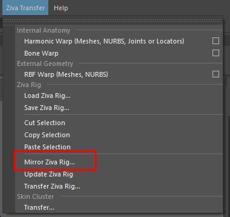
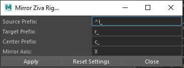
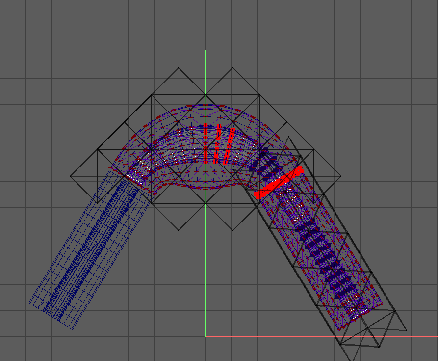
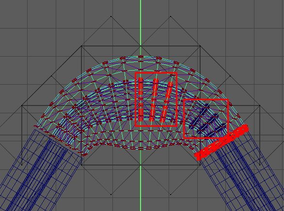
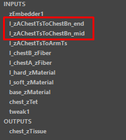
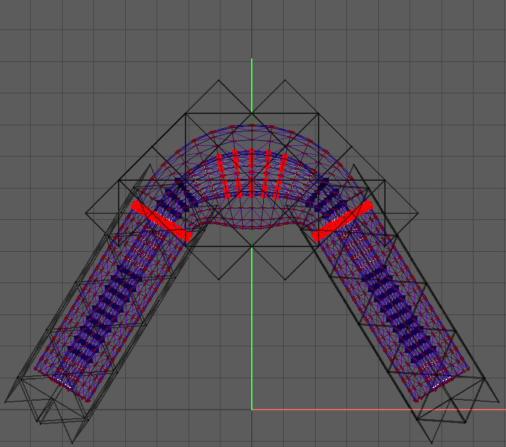

.. include:: <isonum.txt>
.. # define a hard line break for HTML
.. |br| raw:: html

    
   
Tutorials
---------

Basics
~~~~~~

Let's explore zBuilder by applying it to the
anatomical arm demo that ships with the Ziva VFX Maya plugin.

First, set the Python path to zBuilder as explained in the :doc:`installation` section.
Next, run the anatomical arm demo in Maya by navigating to **Ziva Tools** |rarr| **Run Demo** |rarr| **Anatomical Arm**.
Now that the arm :term:`setup` is in the scene, let's start playing with zBuilder.

Retrieving the Ziva rig from the Maya scene
^^^^^^^^^^^^^^^^^^^^^^^^^^^^^^^^^^^^^^^^^^^

Retrieving a whole Ziva rig
***************************

In order to interact with a Ziva scene with zBuilder, 
we first need to create a Ziva :term:`builder` object:

.. code-block:: python

    import zBuilder.builders.ziva as zva
    z = zva.Ziva()

The help command can be called to get some information about the Ziva builder.

.. code-block:: python

    help(z)

The builder can capture the Ziva arm rig by running a method to retrieve the current state of the Ziva Maya scene:

.. code-block:: python

    z.retrieve_from_scene()

There should be an output in the Maya Script Editor that looks something like this:

.. code-block:: python

    # zBuilder.builders.builder : zTissue 7 #
    # zBuilder.builders.builder : map 68 #
    # zBuilder.builders.builder : zAttachment 21 #
    # zBuilder.builders.builder : zMaterial 7 #
    # zBuilder.builders.builder : zEmbedder 1 #
    # zBuilder.builders.builder : zBone 4 #
    # zBuilder.builders.builder : zTet 7 #
    # zBuilder.builders.builder : mesh 11 #
    # zBuilder.builders.builder : zSolver 1 #
    # zBuilder.builders.builder : zSolverTransform 1 #
    # zBuilder.builders.builder : zFiber 6 #
    # zBuilder.utils.commonUtils : Executing retrieve_from_scene() took 0.223s # 

These :term:`scene item<scene item>` stats were retrieved by the builder.
In this case, there are 7 zTissues, 4 zBones, etc.
Scene items typically fall into two categories:

* :term:`Nodes<node>`, which are the Maya dependency graph nodes in the scene.
* :term:`Parameters<node>`, which are the relevant pieces of data associated with nodes, like meshes and :term:`maps<map>`.

The scene items captured in this case are:

* All the Ziva nodes. (zTissue, zTet, zAttachment, etc..)
* Order of the nodes so we can re-create material layers reliably.
* Attributes and values of the nodes. (Including weight maps)
* Sub-tissue information.
* User defined tet mesh reference.  (Not the actual mesh)
* Any embedded mesh reference. (Not the actual mesh)
* Curve reference to drive zLineOfAction. (Not actual curve)
* Relevant zSolver for each node.
* Mesh information used for world space lookup to interpolate maps if needed.

Fortunately, zBuilder handles all of this data, allowing for the treatment of a complex Ziva :term:`rig` as a single logical object.
This object can be saved as a text file, from which the rig can be restored to the captured state at a later time.
It is possible to manipulate the information in the builder before re-applying it.
This is useful for mirroring, for example, which will be described later.

Retrieving parts of a Ziva rig
******************************

Above, the Ziva builder data was retrieved from the entire Maya scene.
However, if only a part of the scene needs to be captured, one can select the items
of interest and call **retrieve_from_scene_selection()**.
This comes in handy when mirroring the setup. 
For example:

.. code-block:: python

    from maya import cmds
    cmds.select('r_bicep_muscle')
    import zBuilder.builders.ziva as zva
    z = zva.Ziva()
    z.retrieve_from_scene_selection()

By default, **retrieve_from_scene_selection()** grabs all items that are connected to the selected items. 
In this example, therefore, it grabs the fibers and attachments connected to the muscle in addition to the muscle itself.
The script editor output should look something like this:

.. code-block:: python

    # zBuilder.builders.builder : zTissue 1 # 
    # zBuilder.builders.builder : map 12 # 
    # zBuilder.builders.builder : zAttachment 4 # 
    # zBuilder.builders.builder : zMaterial 1 # 
    # zBuilder.builders.builder : zEmbedder 1 # 
    # zBuilder.builders.builder : zBone 3 # 
    # zBuilder.builders.builder : zTet 1 # 
    # zBuilder.builders.builder : mesh 5 # 
    # zBuilder.builders.builder : zSolver 1 #
    # zBuilder.builders.builder : zSolverTransform 1 #
    # zBuilder.builders.builder : zFiber 1 #
    # zBuilder.utils.commonUtils : Executing retrieve_from_scene_selection() took 0.080s # 

Notice that only one tissue is being retrieved.

Building
^^^^^^^^

Building takes the data stored in a builder object, and applies it to the Maya scene,
equipping it with the Ziva rig stored in the builder object.

.. note::

    zBuilder does not currently re-create geometry.
    The expectation is that any geometry required by the rig will already exist in the scene,
    and the builder will then apply the rig onto it.
    It's fine if the geometry is already being used in a Ziva rig,
    just as long as the geometry is already in scene.

With the exception of geometry, building restores the state of all nodes and parameters in the builder.
Each scene item is first checked to see if it exists in the Maya scene. 
If it doesn't exist, it is created.
If it does exist, its data values are set to what is stored in the builder.

Restoring a Ziva rig to a previous state
****************************************

This simple example demonstrates how to revert a Ziva rig to a previous state.
First, load the Anatomical Arm Demo.
Then, capture the whole scene (to be used as a restoration point later).

.. code-block:: python

    import zBuilder.builders.ziva as zva
    z = zva.Ziva()
    z.retrieve_from_scene()

Now, the builder object **z** contains the Ziva rig.
Let's make a change to the arm. 
For example, paint a muscle attachment to all white,
something that is easy to identify in viewport.
Now let's apply the builder to it.

.. code-block:: python

    z.build()

It should be clearly visible in the viewport that the state of the arm rig jumped back to the way it was 
when the scene was retrieved. There should also be an output in the script editor:

.. code-block:: python

    # zBuilder.builders.ziva : Building Ziva Rig. # 
    # zBuilder.builders.ziva : Building: zSolver # 
    # zBuilder.builders.ziva : Building: zSolverTransform # 
    # zBuilder.builders.ziva : Building: zBone # 
    # zBuilder.builders.ziva : Building: zTissue # 
    # zBuilder.builders.ziva : Building: zTet # 
    # zBuilder.builders.ziva : Building: zMaterial # 
    # zBuilder.builders.ziva : Building: zAttachment # 
    # zBuilder.builders.ziva : Building: zFiber # 
    # zBuilder.builders.ziva : Building: zEmbedder # 
    # zBuilder.utils.commonUtils : Executing build() took 0.624s # 

Building a Ziva rig from scratch
********************************

It is also possible to build a Ziva rig into a Maya scene that doesn't contain any Ziva nodes or data.
The command is exactly the same as before, applied to a "clean" scene containing only geometry.

First, clean out the entire Ziva rig with the following command:

.. code-block:: python

    import zBuilder.commands as vfx_cmds
    vfx_cmds.clean_scene()

.. note::
    **clean_scene()** is a utility function to remove all of the Ziva footprint in the scene.
    The scene should now be clear of Ziva solver nodes.

Now that the scene has only geometry in it,
let's see what happens when the same builder is applied.

.. code-block:: python

    z.build()

The full Ziva rig should now be restored and acting on the scene's geometry.
zBuilder rebuilt all of the Ziva maya nodes.

Building with differing topologies
**********************************

In production, it is common (unfortunately) for the geometry that goes into a rig
to change.

Let's show how zBuilder can accommodate changes to geometry.
First, let's clean the scene:

.. code-block:: python

    import zBuilder.commands as vfx_cmds
    vfx_cmds.clean_scene()

As an example of changing geometry, let's change the bicep.
A quick way is to apply a mesh smooth.
Once the bicep has a different topology, simply build the same way as before again:

.. code-block:: python

    z.build()

This time the script editor output will be slightly different.
It should be as below:

.. code-block:: python

    # zBuilder.builders.ziva : Building.... #
    # zBuilder.parameters.maps : interpolating map:  r_bicep_muscle_zTet.weightList[0].weights #
    # zBuilder.parameters.maps : interpolating map:  r_bicep_muscle_zMaterial.weightList[0].weights #
    # zBuilder.parameters.maps : interpolating map:  r_bicep_muscle_r_brachialis_muscle.weightList[0].weights #
    # zBuilder.parameters.maps : interpolating map:  r_bicep_muscle_r_brachialis_muscle.weightList[1].weights #
    # zBuilder.parameters.maps : interpolating map:  r_bicep_muscle_r_humerus_bone.weightList[0].weights #
    # zBuilder.parameters.maps : interpolating map:  r_bicep_muscle_r_humerus_bone.weightList[1].weights #
    # zBuilder.parameters.maps : interpolating map:  r_bicep_muscle_r_radius_bone.weightList[0].weights #
    # zBuilder.parameters.maps : interpolating map:  r_bicep_muscle_r_radius_bone.weightList[1].weights #
    # zBuilder.parameters.maps : interpolating map:  r_bicep_muscle_r_scapula_bone.weightList[0].weights #
    # zBuilder.parameters.maps : interpolating map:  r_bicep_muscle_r_scapula_bone.weightList[1].weights #
    # zBuilder.parameters.maps : interpolating map:  r_bicep_muscle_zFiber.weightList[0].weights #
    # zBuilder.parameters.maps : interpolating map:  r_bicep_muscle_zFiber.endPoints #
    # zBuilder.builder : Finished: ---Elapsed Time = 0:00:03.585000 #

Notice that it listed out maps that were interpolated.
This shows that zBuilder noticed the change in topology between the mesh in the
original rig and the new rig.
Furthermore, the call to **build()** modified all the maps painted onto the old mesh
and re-applied them to the new mesh by interpolation.

.. note::

    The maps are currently interpolated in world space of the stored geometry.
    Consequently, if a muscle's new geometry is in a significantly different position in world space,
    the interpolation may not work very well.
    However, it should be fine in cases where the position and shape of the muscle
    only differ slightly.

With this feature, it is possible to bring in any new geometry and build a
previously-captured Ziva scene on it.
Typically the desired geometry will be imported into a scene from an external
source instead of editing it directly in Maya
(ensure that the new mesh is given the same name as the original mesh it's replacing).

Reading/Writing Files
^^^^^^^^^^^^^^^^^^^^^

Writing to disk
***************

Once the arm Ziva rig saved into a builder object in memory, it can be written out to disk:

.. code-block:: python

        # replace path with a working temp directory on your system
        z.write('C:\\Temp\\test.zBuilder')

This writes out a zipped JSON file of all the information, so it can be retrieved later.

Reading from disk
*****************

To test that writing worked properly let's setup the scene with just the geometry again.
Run the Anatomical Arm demo again, then run:

.. code-block:: python

    import zBuilder.commands as vfx_cmds
    vfx_cmds.clean_scene()

Once the scene has just the arm geometry, read the Ziva rig from the file on disk:

.. code-block:: python

    import zBuilder.builders.ziva as zva
    from zBuilder.builders.serialize import read
    z = zva.Ziva()
    # Use the same path here that you used above.
    read('C:\\Temp\\test.zBuilder', z)

The script editor should output something like:

.. code-block:: python

    # zBuilder.builders.serialize : Reading scene items. 134 nodes #
    # zBuilder.builders.serialize : Reading info. #
    # zBuilder.builders.serialize : Assigning builder. #
    # zBuilder.builders.builder : zTissue 7 # 
    # zBuilder.builders.builder : map 68 # 
    # zBuilder.builders.builder : zAttachment 21 # 
    # zBuilder.builders.builder : zMaterial 7 # 
    # zBuilder.builders.builder : zEmbedder 1 # 
    # zBuilder.builders.builder : zBone 4 # 
    # zBuilder.builders.builder : zTet 7 # 
    # zBuilder.builders.builder : mesh 11 # 
    # zBuilder.builders.builder : zSolver 1 # 
    # zBuilder.builders.builder : zSolverTransform 1 # 
    # zBuilder.builders.builder : zFiber 6 # 
    # zBuilder.utils.commonUtils : Executing read() took 0.057s # 

Like before, this is a simple printout that hints at what has been loaded from the file.
Now to build:

.. code-block:: python

    z.build()

Because there was no map interpolation, the output should look as follows:

.. code-block:: python

    # zBuilder.builders.ziva : Building Ziva Rig. # 
    # zBuilder.builders.ziva : Building: zSolver # 
    # zBuilder.builders.ziva : Building: zSolverTransform # 
    # zBuilder.builders.ziva : Building: zBone # 
    # zBuilder.builders.ziva : Building: zTissue # 
    # zBuilder.builders.ziva : Building: zTet # 
    # zBuilder.builders.ziva : Building: zMaterial # 
    # zBuilder.builders.ziva : Building: zAttachment # 
    # zBuilder.builders.ziva : Building: zFiber # 
    # zBuilder.builders.ziva : Building: zEmbedder # 
    # zBuilder.utils.commonUtils : Executing build() took 0.648s # 

The Anatomical Arm rig should now be completely restored back to its original state.

String Replacing
^^^^^^^^^^^^^^^^

Basic string replace operations can be done on the information stored in a builder.
This is very useful if there are name changes in the geometry, 
or to create a basic mirroring of the rig.

When doing a string replace, a search term and a replace term must be provided.
In the context of the Ziva builder, it will search and replace:

* node names
* map names (zAttachment1.weights for example)
* curve names for zLineOfAction
* any mesh name (embedded, user tet)

This works with regular expressions as well.
For example you can search for occurrences of ``r_`` at the beginning of a name.

Changing geometry name
**********************

As before, let's build the Anatomical Arm demo from the Ziva menu and retrieve the Ziva rig into a builder object.

.. code-block:: python

    import zBuilder.builders.ziva as zva
    z = zva.Ziva()
    z.retrieve_from_scene()

To represent a model name change, let's clean the scene and change the name of one of the muscles:

.. code-block:: python

    import zBuilder.commands as vfx_cmds
    vfx_cmds.clean_scene()

    cmds.rename('r_bicep_muscle', 'r_biceps_muscle')

Now the information in the builder is out of sync with the geometry in the scene.
The builder can be updated:

.. code-block:: python

    z.string_replace('r_bicep_muscle','r_biceps_muscle')

When building, the newly-named muscle will be correctly integrated into the rig,
and all the maps painted on that mesh will have their names corrected as well.

.. code-block:: python

    z.build()

.. _mirror:

Mirroring
^^^^^^^^^

Ziva VFX setups can now be mirrored.
This functionality can be accessed through either the UI or a Python command.

.. note::

    In order to successfully mirror a VFX setup, **center_prefix** must be defined if there are center pieces of geometry.
    This is to give zBuilder a full picture of the setup so it can mirror attachments around the geometry's central pieces.
    Without a center prefix defined for existing central geometry, zBuilder will not know what to do with some of the attachments, and the mirror will not work in all cases.

Mirroring Via Window
*********************

The mirror command can be found in the Ziva Transfer menu:

The following window will launch:

.. _arguments:

**source prefix** is the side where the data is being mirrored from.
|br|
**target prefix** is the side where the data is being mirrored to.
|br|
**center prefix** is prefix for the center pieces of geometry.
|br|
**mirror axis** is used if the character is not facing the positive Z direction.
|br|

Mirror Via Python Script
************************

Mirroring can also be done through the command line.
Sometimes this may be preferable as the command can be used as part of a build script with changing arguments.
The custom command can also be used to create a new shelf button.

.. code-block:: python

    import zBuilder.commands as com
    com.mirror()

Here is an example call with all optional arguments set:

.. code-block:: python

    import zBuilder.commands as com
    com.mirror(source_prefix='^l_', target_prefix='r_', center_prefix='c_', mirror_axis='X')

See :ref:`this <arguments>` section for the arguments.

Mirroring a rig
*********************

Mirroring works based on selection.
If the solver is selected, the entire rig will be mirrored.
Alternatively, a particular tissue (or set of tissues) can be mirrored via selection,.

.. note::

    This operation mirrors one side to another.
    If the right side of a setup is being worked on, and is the source, then invoking mirror will replicate the source to the left side of the setup.
    If there are attachments on the left side prior to mirroring, the mirror operation will clean up the left side in order to replicate the right side with the output being an exact copy of the source (right) side.

Here is a typical mirror setup: the center pieces and a source on the right, and the target on the left.

The attachments are connected between two center pieces; in this case, a tissue wrapped around a bone.

Note that the names are prefixed.

In order for mirroring to work there needs to be a source and target prefix.
Without those, the mirroring process will do nothing.
Therefore, despite mirroring attachments that are not attached to a sided piece of geometry, the results can still be expected to look like this:

Mirroring with Center Pieces of Geometry
****************************************

zFibers, zAttachments and zMaterials can be mirrored around a center piece of geometry.
This is based on the name of the node.
If the name starts with **source_prefix** it will get mirrored.
This is useful in cases such as an attachment on the chest connected to the arm.

If using :ref:`Rename Ziva Nodes <naming>`, an attachment between the chest and an arm could be named like so:

.. code-block:: python

    c_chest__l_arm_zAttachment

In this case, the mirror function will split the name at the `__`, and will find the `l_arm_zAttachment` and mirror the attachment.
The following are all valid names as targets for mirroring:

.. code-block:: python

    c_chest__l_arm_zAttachment
    l_bicep__l_trap_zAttachment
    l_bicep_zFiber
    l_soft_zMaterial

.. note::

    This naming convention is not a hard requirement, but an illustrative example. As long as the naming is consistent and meets the requirements laid out here, it will work.

Mirroring Collision Sets
************************

When items with collision sets are mirrored, a multiplier is applied to the sets.
In doing so, the mirrored side is unique, which will result in sets that are different than the source.

Here is an example of what this numbering scheme looks like.

Source side collision set:

.. code-block:: python

    0 10 25 40
    
Mirrored side collision set:

.. code-block:: python

    0 1000 2500 4000

.. note::

    By default the collision set is set to 0 for everything.
    Once mirrored it will still be 0 after it is mirrored meaning that they will share the same collision set.
    
Deformers
^^^^^^^^^

zBuilder fully supports skinClusters, deltaMush, wrap and blendShapes with features such as reading and writing to disk and interpolating weights when topology changes.
In order to use these, select a mesh with any of the listed deformers on it, and run zBuilder.

.. code-block:: python

    from zBuilder.builders.deformers import Deformers
    builder = Deformers()
    builder.retrieve_from_scene()

.. note::

    This will capture all the deformers on the mesh in the order they are created in.
    When a build is performed it will rebuild the deformers in the proper order.

To re-apply those deformers, build with zBuilder.

.. code-block:: python

    builder.build()

When building on a mesh whose topology has changed, the weights will be interpolated on the new mesh.
To force a map interpolation, simply set **interp_maps** to **True**:

.. code-block:: python

    builder.build(interp_maps=True)

To capture only specific deformers, use the **deformers** argument of the retrieve_from_scene() method.

.. code-block:: python

    builder.retrieve_from_scene(deformers=['delataMush'])

The argument can be a list, allowing multiple deformers to be chosen.
If no argument is passed, all deformers are retrieved by default.

Advanced
~~~~~~~~

Here some of the more involved concepts are covered.

Changing values before building
^^^^^^^^^^^^^^^^^^^^^^^^^^^^^^^

It's possible to inspect and modify the contents of the builder before building.
For example, maybe in a specific shot, a Ziva rig with
a value different than what was saved on disk needs to be built.
A common use case is to change the start frame of the Ziva solver based on the shot environment.
Let's try doing that.

Build the Anatomical Arm demo again and retrieve the scene:

.. code-block:: python

    import zBuilder.builders.ziva as zva

    z = zva.Ziva()
    z.retrieve_from_scene()

The scene item that needs to be modified must be found; in this case, the solver has to be changed.
The following code pulls the solver:

.. code-block:: python

    scene_items = z.get_scene_items(name_filter='zSolver1')
    print scene_items[0]

Here the name filter is being used to search for the specific item of interest.
The Maya Script Editor should show something like this:

.. code-block:: python

    = zSolver1 <zBuilder.nodes.ziva.zSolverTransform SolverTransformNode> ==================================
        _builder_type - zBuilder.nodes
        solver - zSolver1Shape
        _name - |zSolver1
        _association - []
        attrs - {u'enable': {'locked': False, 'type': u'bool', 'value': True, 'alias': None}, u'translateX': {'locked': False, 'type': u'doubleLinear', 'value': 0.0, 'alias': None}, u'translateY': {'locked': False, 'type': u'doubleLinear', 'value': 0.0, 'alias': None}, u'translateZ': {'locked': False, 'type': u'doubleLinear', 'value': 0.0, 'alias': None}, u'scaleX': {'locked': False, 'type': u'double', 'value': 100.0, 'alias': None}, u'scaleY': {'locked': False, 'type': u'double', 'value': 100.0, 'alias': None}, u'visibility': {'locked': False, 'type': u'bool', 'value': True, 'alias': None}, u'rotateX': {'locked': False, 'type': u'doubleAngle', 'value': 0.0, 'alias': None}, u'rotateY': {'locked': False, 'type': u'doubleAngle', 'value': 0.0, 'alias': None}, u'rotateZ': {'locked': False, 'type': u'doubleAngle', 'value': 0.0, 'alias': None}, u'scaleZ': {'locked': False, 'type': u'double', 'value': 100.0, 'alias': None}, u'startFrame': {'locked': False, 'type': u'double', 'value': 1.0, 'alias': None}}
        _class - ('zBuilder.nodes.ziva.zSolverTransform', 'SolverTransformNode')
        type - zSolverTransform
        builder - <zBuilder.builders.ziva.Ziva object at 0x000001E90FDB97B8>

That's all the information that the builder has stored for the solver scene item.
To query and change the attributes, go through the ``attrs`` dictionary like so:

.. code-block:: python

    print 'Before:', scene_items[0].attrs['startFrame']['value']
    # set the value of startFrame to 10
    scene_items[0].attrs['startFrame']['value'] = 10
    print 'After:', scene_items[0].attrs['startFrame']['value']

In the above example, the value of start frame is being printed before and after it is changed.

Now if the builder is applied, the startFrame attribute of the **zSolver1** node will be given the new value.
As before, the new value is applied whether or not the **zSolver1** node already existed in the scene before the call to **build()**.

.. code-block:: python

    z.build()
